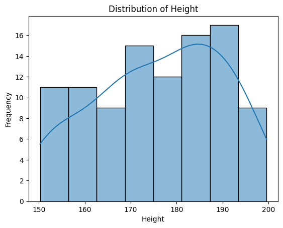
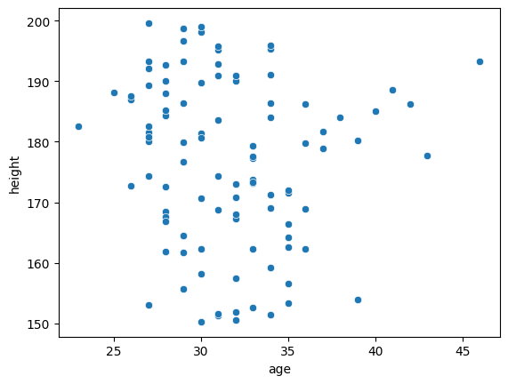
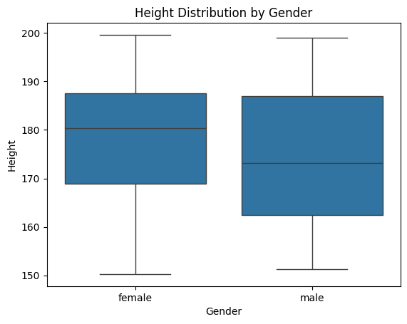
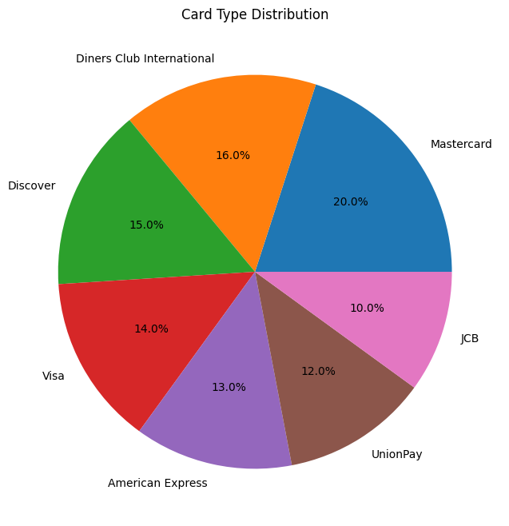
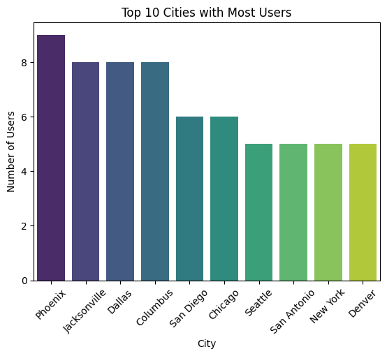

# Data_analytics_libraries

# User Data Analysis (DummyJSON Dataset)

## Overview

This project performs exploratory data analysis (EDA) on a dataset of users retrieved from the DummyJSON API. The goal is to explore basic demographic information such as age, height, weight, and gender using Python data analysis tools.

The notebook demonstrates common data analysis steps including:

* Data collection from an API
* Data cleaning
* Data exploration
* Basic statistical analysis
* Data visualization

## Dataset

The dataset is retrieved from:

https://dummyjson.com/users

The project loads **100 user records** containing fields such as:

* age
* gender
* height
* weight
* name
* email
* address

The JSON data is converted into a **Pandas DataFrame** for analysis.

## Libraries Used

* Pandas
* Seaborn
* Matplotlib
* Requests


## Project Workflow

### 1. Data Collection

User data is fetched using the DummyJSON API.

```python
url = "https://dummyjson.com/users?limit=100"
response = requests.get(url)
data_json = response.json()['users']
data = pd.DataFrame(data_json)
```

The raw dataset is also exported to a CSV file.

### 2. Data Exploration

Initial exploration includes:

* Checking dataset shape
* Listing column names
* Inspecting data types
* Identifying missing values

### 3. Data Cleaning

Missing values in the following columns are handled:

* age
* height
* weight

Missing values are replaced using the **mean of the column**.

### 4. Statistical Analysis

Basic statistics are calculated including:

* Average height
* Average weight
* Correlation between age and height

### 5. Data Visualization

Several visualizations are used to understand the dataset:

**Height Distribution**




**Age vs Height**


Key Observation: No significant correlation between the two attributes was found


**Height by Gender**


Key Observation: boxplot comparison shows that the median height for females appears higher than males in this sample, which may indicate sampling bias or dataset limitations.

## Credit Card Distribution




## Top 10 Cities with Most Users




## Learning Goals

This project demonstrates fundamental skills in:

* API data retrieval
* Data cleaning
* Exploratory data analysis (EDA)
* Data visualization with Python
